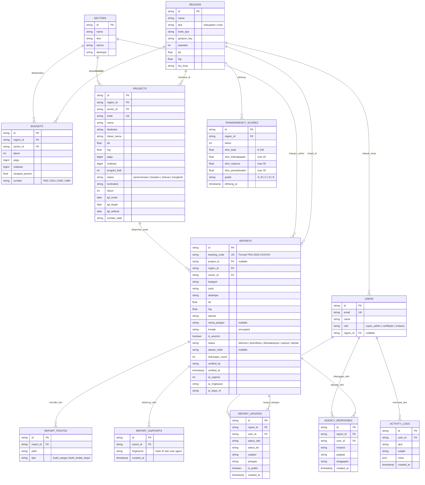

# Entity Relationship Diagram (ERD) TERANG

Diagram relasi entitas basis data platform **TERANG** (Transparansi, Evaluasi, Respons, Akuntabilitas Nusantara):

```mermaid
erDiagram
    REGIONS ||--o{ BUDGETS : "memiliki"
    REGIONS ||--o{ PROJECTS : "berlokasi_di"
    REGIONS ||--o{ REPORTS : "terjadi_di"
    REGIONS ||--o{ TRANSPARENCY_SCORES : "dihitung"
    REGIONS ||--o{ USERS : "wilayah_kerja"

    SECTORS ||--o{ BUDGETS : "dialokasikan"
    SECTORS ||--o{ PROJECTS : "diklasifikasikan"
    SECTORS ||--o{ REPORTS : "kategori_sektor"

    PROJECTS ||--o{ REPORTS : "dilaporkan_pada"

    REPORTS ||--o{ REPORT_PHOTOS : "memiliki_foto"
    REPORTS ||--o{ REPORT_UPDATES : "riwayat_tahapan"
    REPORTS ||--o{ REPORT_SUPPORTS : "didukung_oleh"
    REPORTS ||--o{ AGENCY_RESPONSES : "dijawab_oleh"

    USERS ||--o{ REPORT_UPDATES : "diverifikasi_oleh"
    USERS ||--o{ AGENCY_RESPONSES : "ditanggapi_oleh"
    USERS ||--o{ ACTIVITY_LOGS : "mencatat_aksi"

    REGIONS {
        string id PK
        string nama
        string tipe "kabupaten | kota"
        string kode_bps
        string geojson_key
        int populasi
        float lat
        float lng
        string ibu_kota
    }

    SECTORS {
        string id PK
        string nama
        string ikon
        string warna
        string deskripsi
    }

    BUDGETS {
        string id PK
        string region_id FK
        string sector_id FK
        int tahun
        bigint pagu
        bigint realisasi
        float serapan_persen
        string sumber "PAD | DAU | DAK | DBH"
    }

    PROJECTS {
        string id PK
        string region_id FK
        string sector_id FK
        string kode UK
        string nama
        string deskripsi
        string lokasi_nama
        float lat
        float lng
        bigint pagu
        bigint realisasi
        int progres_fisik
        string status "perencanaan | berjalan | selesai | mangkrak"
        string kontraktor
        int tahun
        date tgl_mulai
        date tgl_target
        date tgl_selesai
        string sumber_data
    }

    REPORTS {
        string id PK
        string tracking_code UK "Format TRG-2026-XXXXXX"
        string project_id FK "nullable"
        string region_id FK
        string sector_id FK
        string kategori
        string judul
        string deskripsi
        float lat
        float lng
        string alamat
        string nama_pelapor "nullable"
        string kontak "encrypted"
        boolean is_anonim
        string status "diterima | diverifikasi | ditindaklanjuti | selesai | ditolak"
        string alasan_tolak "nullable"
        int dukungan_count
        string verified_by
        timestamp verified_at
        int ai_urgensi
        string ai_ringkasan
        string ai_dupe_of
    }

    REPORT_PHOTOS {
        string id PK
        string report_id FK
        string path
        string tipe "bukti_warga | bukti_tindak_lanjut"
    }

    REPORT_UPDATES {
        string id PK
        string report_id FK
        string user_id FK
        string status_dari
        string status_ke
        string catatan
        string petugas
        boolean is_public
        timestamp created_at
    }

    REPORT_SUPPORTS {
        string id PK
        string report_id FK
        string fingerprint "hash IP dan user agent"
        timestamp created_at
    }

    AGENCY_RESPONSES {
        string id PK
        string report_id FK
        string user_id FK
        string instansi
        string pejabat
        string tanggapan
        timestamp created_at
    }

    USERS {
        string id PK
        string email UK
        string name
        string role "super_admin | verifikator | instansi"
        string region_id FK "nullable"
    }

    ACTIVITY_LOGS {
        string id PK
        string user_id FK
        string aksi
        string subjek
        json meta
        timestamp created_at
    }

    TRANSPARENCY_SCORES {
        string id PK
        string region_id FK
        int tahun
        float skor_total "0-100"
        float skor_kelengkapan "max 40"
        float skor_respons "max 30"
        float skor_penyelesaian "max 30"
        string grade "A | B | C | D | E"
        timestamp dihitung_at
    }
```
