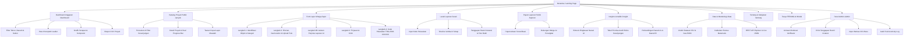

# Peta Situs TERANG (Sitemap)

Arsitektur navigasi dan relasi halaman pada platform **TERANG** (Transparansi, Evaluasi, Respons, Akuntabilitas Nusantara) untuk kompetisi **WIA 2026**:

```mermaid
graph TD
    A[Beranda / Landing Page] --> B[Dashboard Anggaran /dashboard]
    A --> C[Katalog Proyek Publik /proyek]
    A --> D[Form Lapor Warga /lapor]
    A --> E[Lacak Laporan /lacak]
    A --> F[Papan Laporan Publik /laporan]
    A --> G[Insight & Analitik /insight]
    A --> H[Data & Metodologi /data]
    A --> I[Tentang & Kebijakan /tentang]
    A --> J[Tanya TERANG AI Modal]
    A --> K[Panel Admin /admin]

    B --> B1[Filter Tahun, Daerah & Sektor]
    B --> B2[Peta Choropleth Leaflet]
    B --> B3[Grafik Serapan & Komposisi]
    B --> B4[Ekspor CSV Proyek]

    C --> C1[Pencarian & Filter Kesenjangan]
    C --> C2[Detail Proyek & Dual Progress Bar]
    C --> C3[Tautan Cepat Lapor Masalah]

    D --> D1[Langkah 1: Identifikasi Objek & Kategori]
    D --> D2[Langkah 2: Rincian, Geolocation & Upload Foto]
    D --> D3[Langkah 2B: Asisten Perjelas Laporan AI]
    D --> D4[Langkah 3: Tinjauan & Kirim]
    D --> D5[Langkah 4: Kode Pelacakan TRG-2026-XXXXXX]

    E --> E1[Input Kode Pelacakan]
    E --> E2[Timeline Vertikal 4 Tahap]
    E --> E3[Tanggapan Resmi Instansi & Foto Bukti]

    F --> F1[Papan Aduan Terverifikasi]
    F --> F2[Dukungan Warga 1x Perangkat]

    G --> G1[Sintesis Ringkasan Narasi AI]
    G --> G2[Tabel Prioritas Audit Risiko Kesenjangan]
    G --> G3[Perbandingan Daerah A vs Daerah B]

    H --> H1[Unduh Dataset CSV & GeoJSON]
    H --> H2[Kalkulator Rumus Matematis]
    H --> H3[REST API Explorer & Live JSON]

    K --> K1[Antrean Moderasi Verifikator]
    K --> K2[Kirim Tanggapan Resmi Instansi]
    K --> K3[Impor Berkas CSV Baru]
    K --> K4[Audit Trail & Activity Log]
```
